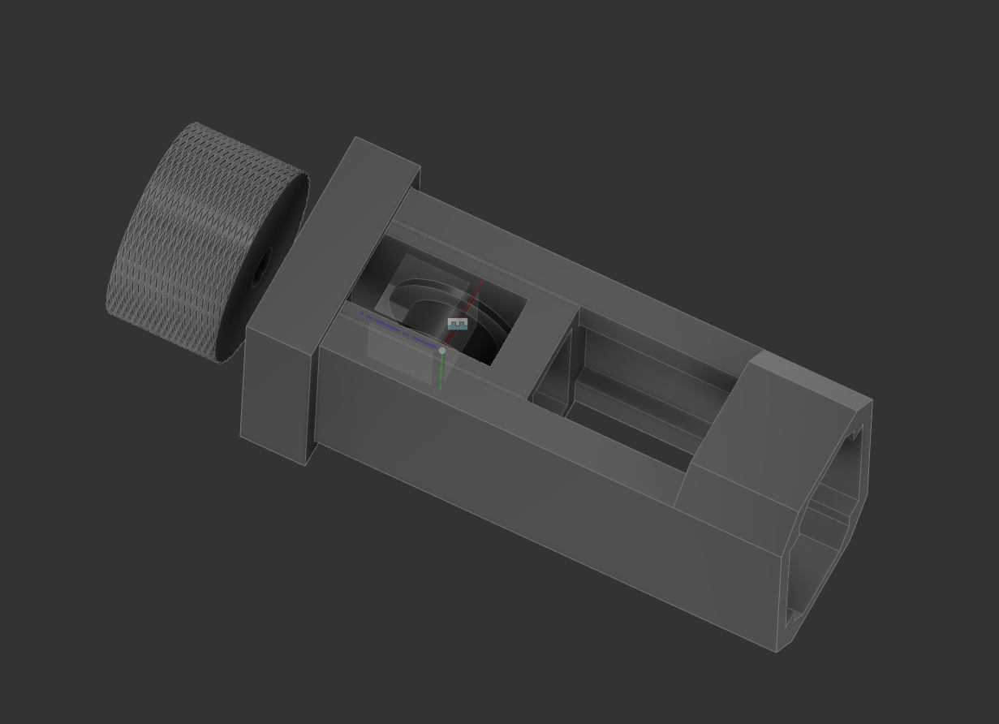
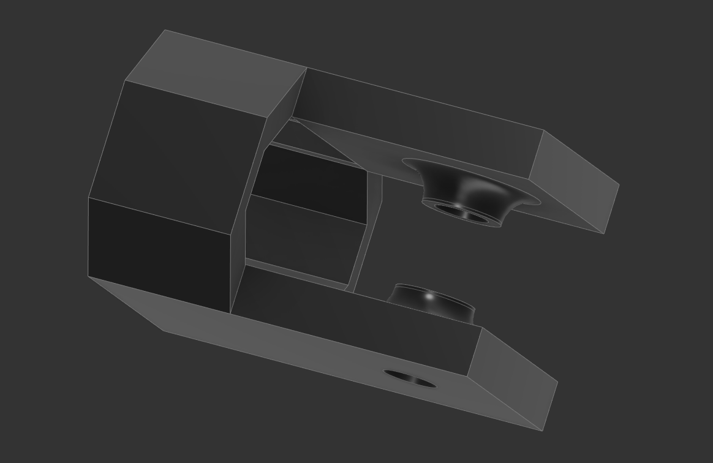

# 2020 Extrusion Tensioner and Idler for GT2 Belt

Quick little pulley and tensioner system to play with at my desk.

I used this:
- timing belt: https://smile.amazon.com/gp/product/B07ZNNR238
- These pulleys: https://smile.amazon.com/gp/product/B07JNQQKTC/

# Parts

- "tensioner bracket" - mounts on end of extrusion, holds the tensioner
- "tensioner cap" - holds the tensioner together, knob travel stop
- "tensioner slider" - fits inside bracket, holds GT2 20T pulley with M5x14mm button head screw.  M5x25mm buttonhead screw suggested for knob connection
- "idler bracket" - holds GT2 20T pulley

# Changelog

2021/04/07 - Added arch around mount to extrusion, minimize belt interference when near end of axis
2021/04/06 - Initial commit

## Design

Autocad Fusion 360 

## Slicer

Ultimaker Cura 4.8.0
- Printer: Creality CR6 SE
- Layer Height: 0.2mm
- Infill Density: 50%
- Infill Pattern: Grid
- Filament: Inland PLA+ 1.75mm Blue
- Material: PLA+
- Print Temperature: 215 degrees C

# Preview

